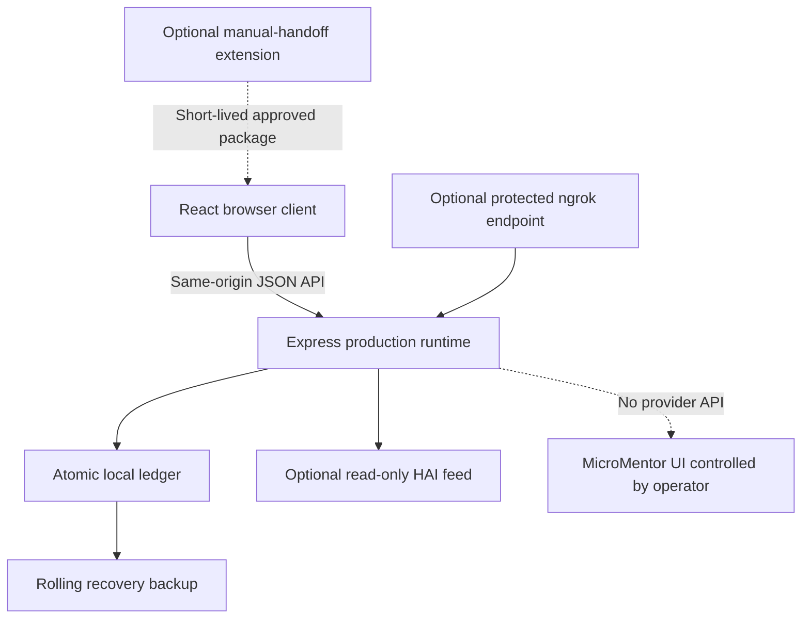

# MARO - MicroMentor Outreach Console

MARO is a local-first workspace for planning, reviewing, recording, and measuring mentor outreach. It helps one operator organize campaigns, evaluate potential mentors, prepare approved messages, record manual delivery evidence, manage replies and follow-ups, and retain an audit trail.

MARO does **not** scrape MicroMentor, sign in to MicroMentor, or send messages automatically. Discovery and the final Send action remain deliberate human steps.

The application runs as one React and Express process backed by an atomic local ledger. It can run directly on a computer, from a Windows 11 installer, in a hardened Docker container, or through a protected ngrok tunnel. An optional HAI connector exposes read-only next-action cards.

## At A Glance

| Item | Current implementation |
| --- | --- |
| Product type | Single-user, local-first outreach operating ledger |
| Primary use | Structured mentor discovery, review, manual outreach, follow-up, and outcome tracking |
| Frontend | React 18, TypeScript, Tailwind CSS, Radix UI primitives |
| Backend | Express 4 and TypeScript, bundled with esbuild |
| Data store | Schema-versioned atomic JSON or AES-256-GCM encrypted JSON |
| Windows storage | Per-user encrypted ledger with a DPAPI-protected key |
| Public access | Optional ngrok HTTPS endpoint protected by Traffic Policy Basic Auth |
| HAI integration | Disabled-by-default, read-only `generic_json_feed` |
| Provider automation | None; MicroMentor discovery and sending are manual |
| Current package version | `1.2.3` |
| Supported development runtime | Node.js 22 LTS; CI and Windows packaging use the exact version in `.node-version` |

## Who This Repository Is For

### Outreach operators

Use MARO to keep mentor outreach organized without handing message delivery to an opaque automation system. The dashboard tells you what needs attention, what is blocked, and what can be done next.

### Non-technical Windows users

Use the Windows installer, open MARO from the desktop or Start Menu, and work in the browser window it opens. Your workspace remains on your computer and survives application upgrades or uninstall/reinstall cycles.

### Developers and maintainers

Use the production Express runtime, typed React client, real encrypted-ledger smoke test, Docker image, release gate, and Windows packaging workflow to develop or audit the product.

### Local integrations

Read operational state from the API or enable the HAI feed. Integrations do not receive authority to approve messages, confirm delivery, or mutate a provider.

## Product Boundary

MARO is intentionally an **assisted outreach console**, not an autonomous outreach bot.

MARO can:

- organize projects, campaigns, source searches, and mentor profiles;
- score mentor fit using transparent campaign criteria;
- generate deterministic draft and follow-up suggestions;
- enforce review, approval, do-not-contact, cooldown, and pause controls;
- prepare a short-lived approved handoff package;
- record delivery evidence, uncertainty, responses, outcomes, and costs;
- export campaign history and workspace backups;
- expose read-only operational cards to HAI.

MARO cannot:

- scrape MicroMentor or other websites;
- authenticate to a mentor platform;
- discover people in the background;
- click Send or claim a provider action succeeded;
- charge a customer or create an external invoice;
- act as a multi-user SaaS service with application-level accounts or RBAC.

This boundary is a safety feature. A message is not recorded as sent until the operator supplies delivery evidence or explicitly records an uncertain attempt.

## How The Workflow Works

```mermaid
flowchart LR
    A["Define project and campaign"] --> B["Plan and record source searches"]
    B --> C["Add or import mentor profiles"]
    C --> D["Review fit, confidence, duplicates, and DNC"]
    D --> E["Create and quality-check a draft"]
    E --> F["Approve the exact message snapshot"]
    F --> G["Open manual handoff"]
    G --> H["Send in the provider UI"]
    H --> I["Record sent, failed, or uncertain evidence"]
    I --> J["Track responses and follow-ups"]
    J --> K["Record outcomes, costs, and exports"]
```



The practical operator flow is:

1. Complete the first-run workspace acknowledgement.
2. Create or select a project and campaign.
3. Define the campaign goal, target mentor type, fit criteria, tone, and follow-up rule.
4. Use MARO's discovery plan to guide manual searches on MicroMentor, LinkedIn, or the open web.
5. Record each search and add mentors manually or by CSV import.
6. Review fit evidence, confidence, duplicate warnings, and do-not-contact state.
7. Create a draft and resolve any quality blocker.
8. Approve the exact subject and body.
9. Prepare the handoff, review the provider profile, and send manually.
10. Record confirmed delivery, failure, or uncertainty.
11. Record the response, follow-up, and final outcome.
12. Export campaign history, usage evidence, invoice records, or a workspace backup.

## Main Product Areas

### Command dashboard

- Shows active campaign context, campaign readiness, queue counts, and local costs.
- Prioritizes deterministic next actions instead of generic activity metrics.
- Highlights blockers and attention items before a campaign can be completed.
- Displays local/ngrok reachability, authentication state, storage mode, and app version.

### Projects and campaigns

- Groups related outreach campaigns under a project.
- Stores campaign goal, target mentor type, source, status, fit criteria, tone, and follow-up timing.
- Supports active, paused, completed, and archived campaign states.
- Re-scores existing mentors only when scoring inputs change.
- Blocks campaign completion while readiness checks still contain blockers or attention items.

### Discovery and source evidence

- Builds a local campaign-specific discovery plan.
- Recommends MicroMentor, LinkedIn, and open-web research paths.
- Copies prepared queries without putting campaign data into external URLs.
- Records planned, searched, imported, skipped, result-count, and note evidence.
- Links imported mentors back to the search that produced them.

### Mentor intake and fit review

- Adds profiles manually or imports pasted/uploaded CSV.
- Supports configurable column mapping and duplicate preview.
- Stores skills, industries, location, profile URL, biography, and notes.
- Computes a transparent fit score with reasons, risks, and threshold evidence.
- Detects duplicate identities and profile URLs without deleting source history.
- Supports durable do-not-contact state and identity cooldown.

### Drafting and approval

- Generates deterministic campaign-aware drafts; no external AI provider is required.
- Checks unresolved template tokens, personalization, length, reading time, and call to action.
- Requires explicit approval of the exact subject/body snapshot.
- Invalidates approval whenever approved content changes.
- Prevents duplicate active or sent outreach for the same campaign identity.

### Manual delivery

- Produces a short-lived handoff package only after approval.
- Blocks handoff when paused, opted out, cooling down, stale, or duplicated.
- Records confirmed, failed, or uncertain delivery attempts.
- Never turns a failed or uncertain attempt into fake success.
- Requires uncertainty to be resolved before retrying.

### Responses, follow-ups, and outcomes

- Classifies responses and stores response evidence.
- Schedules follow-ups only after confirmed delivery.
- Converts a due follow-up into a new review-gated draft.
- Cancels pending follow-ups when a mentor declines or is unavailable.
- Tracks response rate, booking rate, positive outcomes, and overdue follow-ups.

### Cost and reporting records

- Measures local Node CPU time, RSS memory duration, ledger size, and observed API bytes.
- Applies the transparent `Resource Cost x 2 = Final Price` rule.
- Creates local invoice-report snapshots; it does not charge anyone.
- Exports mentors, campaign history, usage reports, and workspace backups.

### Audit, recovery, and privacy

- Records material workflow and safety events in the local audit history.
- Offers integrity checks, retention preview/apply, reset scopes, and a sanitized support bundle.
- Uses session privacy mode to hide notes, message bodies, responses, follow-ups, and evidence.
- Validates backup schema, IDs, and cross-record references before restore.

## Safety Model

MARO is designed around explicit human control and fail-closed behavior.

| Control | What it prevents |
| --- | --- |
| Exact approval snapshots | Sending edited content under an old approval |
| Manual provider handoff | Hidden or autonomous provider actions |
| Do-not-contact | Drafting or sending to an opted-out mentor |
| Identity cooldown | Repeated outreach within the configured cooling period |
| Workspace pause | New handoffs and send confirmations while review is underway |
| Environment pause | Local operators cannot bypass an administrator-forced stop |
| Duplicate guard | Parallel outreach to the same identity/profile in one campaign |
| Uncertain-delivery state | Retrying an action that may already have succeeded |
| Idempotency keys | Replaying the same local mutation accidentally |
| Exact Host allowlist | DNS rebinding and unrelated ngrok hostnames |
| Cross-site mutation guard | Foreign pages submitting changes to the local API |
| Read-only HAI feed | External orchestration gaining approval or send authority |

## Architecture



### Runtime composition

- `client/` contains the React frontend.
- `server/index.ts` configures the production web server and request security.
- `server/ledger.ts` contains the domain model, persistence, invariants, and API routes.
- `scripts/build.mjs` builds the client with Vite and bundles the server with esbuild.
- `dist/index.cjs` serves both `/api/*` and `dist/public/*` from one Node process.

Vite is a **compiler only**. It is not the deployed or default development server. `npm run dev` builds the production application and launches the guarded Express/ngrok flow.

### Why the data layer is JSON

MARO is currently a single-user desktop/local application. Its data layer is a schema-versioned ledger rather than a shared SQL service. This keeps installation simple, makes backups portable, and preserves the operating-system account as the workspace boundary.

The ledger still provides database-like safety properties appropriate to this product:

- normalized schema version 1 records;
- unique IDs and referential-integrity validation;
- flushed temporary writes followed by atomic replacement;
- a rolling previous-valid-state backup;
- recovery auditing;
- AES-256-GCM encryption with scrypt-derived keys;
- deterministic migration/default normalization for older workspaces.

A future multi-user service would require a separate identity, authorization, and shared-database design. This repository does not pretend that the local ledger is multi-tenant infrastructure.

## Windows 11: Install And Use MARO

### What you receive

The Windows build produces one self-extracting installer:

```text
artifacts/MARO-Windows11-Setup.exe
```

GitHub Actions also builds and uploads an artifact named `MARO-Windows11-Setup` for each successful workflow run. The project does not yet publish a signed GitHub Release, so access to workflow artifacts may require a GitHub account. Only use an installer supplied by the repository owner or built from a verified commit.

### Install

1. Run `MARO-Windows11-Setup.exe`.
2. Windows may show an unknown-publisher warning because the installer is not Authenticode-signed.
3. After installation, open the desktop shortcut named **MARO** or use **Start > MARO > MARO**.
4. MARO chooses port `3000` or the next available loopback port and opens the app in your browser.
5. Complete the workspace acknowledgement before beginning outreach work.

The installer uses:

| Purpose | Location |
| --- | --- |
| Replaceable application files | `%LOCALAPPDATA%\MARO` |
| Durable workspace and protected key | `%LOCALAPPDATA%\MARO-Data` |
| Desktop shortcut | `%USERPROFILE%\Desktop\MARO.lnk` |
| Start Menu shortcuts | `%APPDATA%\Microsoft\Windows\Start Menu\Programs\MARO` |

### Data protection

The installer generates a random ledger key with the Windows cryptographic random generator. The key is protected for the current Windows user with DPAPI. The ledger itself is encrypted with AES-256-GCM.

Application upgrades replace only application files. They preserve the ledger and protected key byte-for-byte, migrate older workspaces without overwriting conflicts, and stop only the MARO process recorded by that installation.

### Upgrade

Run the newer installer while MARO is open or closed. The installer:

1. verifies ownership of the recorded MARO process;
2. waits for that process to exit;
3. migrates legacy data when needed;
4. rotates application directories atomically;
5. rolls back application files if replacement fails;
6. leaves `%LOCALAPPDATA%\MARO-Data` untouched.

### Uninstall

Use **Windows Settings > Apps > Installed apps** or **Start > MARO > Uninstall MARO**.

Uninstall removes the application but intentionally keeps `%LOCALAPPDATA%\MARO-Data`. Export a verified workspace backup before manually deleting that directory.

## Developer Quick Start

### Requirements

- Node.js 22 LTS (use the exact version in `.node-version` for Windows packaging)
- npm
- Git
- Windows 11, macOS, or Linux
- ngrok CLI only when testing public tunnel behavior
- Docker Desktop or Docker Engine only when testing the container path

On Windows PowerShell, use `npm.cmd` if script execution policy blocks `npm.ps1`.

### Install dependencies and run preflight

```powershell
npm.cmd ci
npm.cmd run doctor
```

### Run locally without ngrok

```powershell
npm.cmd run build
npm.cmd start
```

Open `http://127.0.0.1:3000`.

To select another port:

```powershell
$env:PORT = "3205"
npm.cmd start
```

### Run the protected ngrok development flow

```powershell
$env:NGROK_BASIC_AUTH = "operator:use-a-long-password"
npm.cmd run dev
```

`npm run dev` and `npm run preview` both invoke the production build plus guarded tunnel launcher. They do not start a Vite development server.

## ngrok Cloud Access

ngrok makes the local MARO process reachable through an HTTPS endpoint. It does not turn MARO into a multi-user SaaS service.

### Prerequisites

Install ngrok and authenticate its CLI:

```powershell
ngrok config add-authtoken <your-token>
```

Start MARO with protected access:

```powershell
$env:NGROK_BASIC_AUTH = "operator:use-a-long-password"
npm.cmd run dev
```

MARO refuses to open a normal public tunnel without Basic Auth. Authentication is applied through an ngrok Traffic Policy action, not a deprecated command-line credential flag.

### Dedicated endpoint

If the ngrok account has multiple tools online, configure MARO's dedicated HTTPS URL:

```powershell
$env:NGROK_BASIC_AUTH = "operator:use-a-long-password"
$env:MARO_NGROK_URL = "https://your-dedicated-endpoint.example"
npm.cmd run dev
```

The launcher:

- validates that the URL is HTTPS;
- locates only the endpoint targeting MARO's loopback port;
- probes ngrok Agent API ports `4040` through `4050` with bounded timeouts;
- publishes only the exact endpoint hostname to the server allowlist;
- does not stop or reuse unrelated local ngrok tools.

An unrelated `*.ngrok.app` Host is rejected with HTTP 421 even while MARO's own tunnel is active.

### Deliberately public tunnel

This is not recommended. It exposes the local workspace to anyone who has the URL unless another access layer exists.

```powershell
$env:MARO_ALLOW_PUBLIC_TUNNEL = "1"
npm.cmd run dev
```

The command dashboard shows a first-viewport warning when an explicitly public tunnel has no Basic Auth.

## Docker

Docker Compose requires encrypted persistence and fails closed when the passphrase is missing.

### PowerShell

```powershell
$env:MARO_LEDGER_PASSPHRASE = "use-a-long-unique-passphrase"
docker compose up --build
```

### Bash

```bash
export MARO_LEDGER_PASSPHRASE="use-a-long-unique-passphrase"
docker compose up --build
```

Open `http://127.0.0.1:8080`.

The Compose service:

- binds only to host loopback;
- runs as the non-root `maro` user;
- uses a read-only root filesystem;
- drops all Linux capabilities;
- enables `no-new-privileges`;
- mounts a 16 MB `noexec,nosuid` temporary filesystem;
- persists data in the named `maro-data` volume;
- checks `/api/readiness` every 30 seconds;
- restarts unless explicitly stopped.

To force outbound actions paused in Docker:

```powershell
$env:MARO_OUTBOUND_PAUSED = "1"
docker compose up --build
```

## HAI Connector

MARO's HAI integration is disabled by default and read-only.

Enable it before starting the process:

```powershell
$env:MARO_HAI_FEED_ENABLED = "1"
npm.cmd run build
npm.cmd start
```

Available integration routes:

- `GET /api/integrations/hai/status`
- `GET /api/integrations/hai/manifest`
- `GET /api/integrations/hai/feed`

The feed implements `hai.generic_json_feed.v1` and provides:

- stable external IDs beginning with `maro:`;
- campaign readiness and blocker context;
- bounded next-action cards;
- a cursor and ETag/304 conditional reads;
- manual-only authority metadata.

The feed is bounded to 250 cards. It cannot approve drafts, confirm sends, mutate providers, or obtain authority over MicroMentor.

For a local HAI container, register a URL such as:

```text
http://host.docker.internal:3000/api/integrations/hai/feed
```

Use the actual MARO port when it differs. Enable the feed only for an owner-scoped HAI workspace or behind protected transport, because action cards may contain mentor context.

## Manual Handoff Browser Extension

MARO can build or download a Manifest V3 extension that fills one approved package into the active matching MicroMentor page.

The extension requests only:

- `activeTab`;
- `scripting`;
- clipboard write access.

It has no background worker, persistent host permission, storage, queue processor, network client, or Send action.

### Install locally

1. Download `maro-manual-handoff-extension.zip` from MARO or build it with `npm run build:extension`.
2. Extract the ZIP.
3. Open `chrome://extensions`.
4. Enable **Developer mode**.
5. Choose **Load unpacked** and select the extracted folder.

### Use

1. Approve the exact message in MARO.
2. Choose **Copy for extension**.
3. Open the matching MicroMentor profile and choose **Request Mentorship**.
4. Click the **Customize your message** box once so MicroMentor activates its editor.
5. Open the extension and paste the package.
6. Choose **Fill approved draft**.
7. Review the populated message and press Send manually.

Handoff packages expire after ten minutes. If the MicroMentor editor is not activated or direct field filling is unavailable, the extension falls back to copying the approved subject and body for manual paste. The extension never sends a request.

## Configuration Reference

Copy `.env.example` as a reference, but do not commit real secrets.

| Variable | Default | Purpose |
| --- | --- | --- |
| `HOST` | `127.0.0.1` | Address used by the direct Node server |
| `PORT` | `3000` | Local HTTP port |
| `NODE_ENV` | unset | Set to `production` for production response behavior |
| `MARO_DATA_DIR` | `<repo>/data` | Directory containing the ledger and rolling backup |
| `MARO_LEDGER_PASSPHRASE` | unset | Enables AES-256-GCM ledger encryption; required by Compose |
| `MARO_OUTBOUND_PAUSED` | `0` | Set to `1` to force handoff/send operations paused |
| `MARO_HAI_FEED_ENABLED` | `0` | Set to `1` to expose the read-only HAI feed |
| `NGROK_BASIC_AUTH` | unset | `user:password` credentials required by the normal tunnel flow |
| `MARO_NGROK_URL` | unset | Optional dedicated ngrok HTTPS endpoint |
| `MARO_ALLOW_PUBLIC_TUNNEL` | `0` | Set to `1` only for deliberate unauthenticated exposure |
| `MARO_ALLOWED_HOSTS` | unset | Comma-separated exact hosts for a trusted reverse proxy |
| `MARO_APP_VERSION` | build version | Runtime version override used by packaged launchers |

`MARO_ALLOWED_HOSTS_FILE` and `MARO_BUILD_VERSION` are launcher/build internals. Normal operators should not set them manually.

Never commit:

- `MARO_LEDGER_PASSPHRASE`;
- `NGROK_AUTHTOKEN`;
- `NGROK_BASIC_AUTH`;
- an unredacted workspace backup;
- runtime ledger or DPAPI key files.

Losing the encryption passphrase or Windows-protected key means the encrypted ledger cannot be recovered. Keep verified backups and credential recovery procedures outside this repository.

## API Contract

The React client and API are served from the same origin.

### Request rules

- All API responses use `Cache-Control: no-store`.
- JSON bodies are limited to 1 MB.
- Each remote address is limited to 300 API requests per 60-second window.
- All `POST`, `PATCH`, `PUT`, and `DELETE` requests require `X-MARO-Request: 1`.
- Cross-site browser mutations are rejected.
- Mutations may include an `Idempotency-Key` of 8 to 128 safe characters.
- Successful/non-server-error idempotent responses are replayable for ten minutes.
- Reusing a key with different content returns HTTP 409.
- Structured errors include `error`, and where available `code`, `requestId`, and `retryable`.
- Exact Host validation applies before API handling.

The React client adds the mutation and idempotency headers automatically. Trusted local integrations must add them explicitly.

### Endpoint groups

<details>
<summary>Runtime and workspace</summary>

- `GET /api/health`
- `GET /api/readiness`
- `GET /api/diagnostics`
- `GET /api/runtime/status`
- `GET|PATCH /api/workspace/settings`
- `GET /api/workspace/integrity`
- `POST /api/workspace/support-bundle`
- `POST /api/workspace/retention`
- `POST /api/workspace/backup`
- `POST /api/workspace/restore/preview`
- `POST /api/workspace/restore`
- `POST /api/workspace/reset`
- `GET /api/ledger/summary`
- `GET /api/dashboard`
- `GET /api/actions`

</details>

<details>
<summary>Projects, campaigns, discovery, and mentors</summary>

- `GET|POST /api/projects`
- `PATCH /api/projects/:id`
- `GET|POST /api/campaigns`
- `GET|PATCH /api/campaigns/:id`
- `GET /api/campaigns/:id/actions`
- `GET|POST /api/campaigns/:id/discovery-plan`
- `GET|POST /api/campaigns/:id/sources`
- `PATCH /api/sources/:id`
- `GET|POST /api/campaigns/:id/mentors`
- `POST /api/campaigns/:id/mentors/import`
- `POST /api/campaigns/:id/mentors/export`
- `POST /api/campaigns/:id/history/export`
- `GET|POST /api/mentors`
- `GET|PATCH /api/mentors/:id`
- `GET /api/mentors/:id/timeline`
- `POST /api/mentors/:id/resolve-duplicate`

</details>

<details>
<summary>Messages, delivery, responses, and follow-ups</summary>

- `GET|POST /api/campaigns/:id/messages`
- `GET /api/campaigns/:id/follow-ups`
- `GET|POST /api/messages`
- `PATCH /api/messages/:id`
- `POST /api/messages/:id/approve`
- `POST /api/messages/:id/reject`
- `POST /api/messages/:id/handoff`
- `POST /api/messages/:id/send-attempt`
- `POST /api/send-attempts/:id/resolve`
- `GET|POST /api/responses`
- `GET|POST /api/follow-ups`
- `PATCH /api/follow-ups/:id`
- `POST /api/follow-ups/:id/draft`
- `POST /api/follow-ups/:id/complete`
- `POST /api/follow-ups/:id/cancel`
- `GET|POST /api/outcomes`

</details>

<details>
<summary>Billing, audit, and HAI</summary>

- `POST /api/resource-sessions`
- `POST /api/resource-sessions/:id/end`
- `GET /api/billing`
- `GET /api/campaigns/:id/usage-report`
- `GET /api/invoices`
- `GET|POST /api/campaigns/:id/invoices`
- `GET /api/audit`
- `GET /api/integrations/hai/status`
- `GET /api/integrations/hai/manifest`
- `GET /api/integrations/hai/feed`

</details>

Export endpoints are guarded mutations because they append audit evidence.

## Data, Backup, And Recovery

### Files

The direct development runtime uses:

```text
data/maro-ledger.json
data/maro-ledger.json.backup
```

Runtime data is ignored by Git. Override the directory with `MARO_DATA_DIR`.

### Atomic persistence

Every successful mutation is normalized, serialized to a flushed temporary file, and atomically moved into place. The previous valid primary is retained as the rolling backup. If the primary cannot be parsed or decrypted, MARO attempts the backup and records a high-risk recovery event.

### Workspace backups

Portable backups use:

```json
{
  "kind": "maro-workspace-backup",
  "schemaVersion": 1
}
```

Restore is a two-step operation:

1. preview and validate the backup;
2. apply it with explicit confirmation.

Validation covers required arrays, record IDs, duplicates, and cross-record references. Treat backup files as sensitive personal data even when the runtime ledger is encrypted.

### Reset and retention

Reset supports queue, mentor, and complete-workspace scopes and requires explicit confirmation. Retention runs as preview before apply and prunes only eligible old low-risk audit events.

## Available Commands

| Command | Purpose |
| --- | --- |
| `npm run dev` | Build and start the guarded ngrok production flow |
| `npm run preview` | Alias of the guarded tunnel flow |
| `npm run build` | Build React assets, Express bundle, and extension ZIP |
| `npm run start` | Start `dist/index.cjs` locally |
| `npm run build:extension` | Build only the extension ZIP |
| `npm run installer:win` | Build the production app and Windows installer |
| `npm run doctor` | Validate runtime, lockfile, data directory, encryption, tunnel, and safety configuration |
| `npm run check` | Type-check client and Node build code |
| `npm run check:api` | Build and run the encrypted API smoke workflow |
| `npm test` | Run the production API suite and manual-handoff extension checks |
| `npm run audit:security` | Run `npm audit --audit-level=low` |
| `npm run check:release` | Run the complete local release gate, including Windows installation acceptance on Windows |
| `npm run format` | Format the repository with Prettier |

## Testing And Release Evidence

### Automated workflow

`npm test` starts the real production bundle on an isolated port with an encrypted temporary ledger. It executes the full operational path through HTTP and produces 43 audit events.

Coverage includes:

- project and campaign create/update;
- source planning and mentor import;
- fit scoring and re-scoring;
- draft creation, quality checks, approval, and stale approval;
- manual handoff and confirmed/failed/uncertain attempts;
- responses, follow-ups, outcomes, billing, and invoices;
- backup, restore, retention, integrity, and recovery;
- hostile Host, cross-site mutation, malformed/oversized JSON, and rate boundaries;
- pause, do-not-contact, cooldown, duplicate identities, and idempotency;
- HAI manifest/feed authority, cursor, and ETag behavior;
- CSV spreadsheet-formula neutralization and support-bundle redaction.

### Release gate

Run on Windows:

```powershell
npm.cmd run check:release
```

The gate runs:

1. ngrok policy and source assertions;
2. `npm run doctor`;
3. dependency vulnerability audit;
4. both TypeScript checks;
5. manual-handoff extension checks, including popup expiry and target-page guards;
6. production build and encrypted API workflow;
7. Windows installer build using the exact x64 Node version in `.node-version`;
8. isolated legacy migration and bundled-runtime identity check;
9. installed encrypted runtime launch without development tools on PATH;
10. configuration-triggered restart and ownership-checked stop;
11. stopped and in-use upgrade preservation;
12. portable backup restore into a fresh installation with a new encryption key, followed by restart;
13. final installer SHA-256 output.

### Continuous integration

GitHub Actions runs on every push and pull request:

- Ubuntu: clean install, doctor, typecheck, security audit, tests, and Docker build.
- Windows: clean dependency install, the complete release gate above, and `MARO-Windows11-Setup` artifact upload after acceptance passes.

The 1.2.3 candidate's checks and remaining acceptance work are recorded in
[`docs/PRODUCTION_READINESS.md`](docs/PRODUCTION_READINESS.md). Historical browser,
Docker, ngrok, HAI and Windows evidence for 1.2.2 remains in
[`docs/FINAL_VERIFICATION_REPORT.md`](docs/FINAL_VERIFICATION_REPORT.md); it does not
by itself verify the current candidate.

### Last measured resource baseline

These figures are evidence from the final verification run, not universal guarantees:

| Surface | Observed value |
| --- | --- |
| Browser payload | 377,717 bytes across four production files |
| JavaScript bundle | 324.76 KB, 90.55 KB gzip |
| CSS bundle | 39.84 KB, 7.56 KB gzip |
| Packaged Node working set | 51.54 MiB |
| Packaged Node private memory | 32.06 MiB |
| Dashboard reads through PowerShell HTTP | 31.28 ms median, 51.44 ms p95 |
| Hardened container idle memory | 19.5 MiB |
| Hardened container idle CPU sample | 0.05% |

## Troubleshooting

### `npm` is blocked in PowerShell

Use `npm.cmd` instead of `npm`:

```powershell
npm.cmd ci
npm.cmd run doctor
```

### MARO will not start

1. Run `npm run doctor`.
2. Check whether the selected port is already occupied.
3. Try another loopback port with `PORT`.
4. Read `GET /api/readiness` and `GET /api/diagnostics`.
5. Check the local startup logs or installed `%LOCALAPPDATA%\MARO-Data` logs.

### Encrypted ledger cannot be opened

Verify that the same `MARO_LEDGER_PASSPHRASE` is available. For an installed Windows copy, launch MARO as the same Windows user who installed it. MARO cannot recover data without the correct passphrase or DPAPI-protected key.

### ngrok refuses to start

Verify that:

- ngrok is installed and authenticated;
- `NGROK_BASIC_AUTH` is set;
- `MARO_NGROK_URL`, when present, is a valid HTTPS endpoint for this account;
- another local service is not using all ngrok Agent API inspector ports;
- the endpoint targets MARO's actual loopback port.

### Tunnel returns HTTP 401

This is expected without the configured Basic Auth credentials.

### Tunnel returns HTTP 421

The request Host is not the exact endpoint MARO launched or an explicitly trusted host. Do not broadly allow all ngrok domains. Check `MARO_NGROK_URL`, the runtime-status panel, and launcher output.

### HAI feed returns HTTP 503

Set `MARO_HAI_FEED_ENABLED=1` and restart MARO. Confirm the manifest reports `enabled: true` before registering the feed.

### Windows upgrade reports files are in use

Close MARO and retry. The installer fails without changing workspace data when it cannot prove the owned runtime stopped or cannot rotate application files safely.

### Browser extension does not fill fields

Confirm that:

- the package is less than ten minutes old;
- the active page is the matching mentor profile;
- the exact draft is still approved;
- extension permissions are available for the active tab.

Use the extension's copy fallback and paste manually when provider form structure has changed.

## Repository Map

| Path | Purpose |
| --- | --- |
| `client/` | React application, UI components, API client, and styles |
| `server/index.ts` | Express runtime, security middleware, runtime status, and static serving |
| `server/ledger.ts` | Domain types, persistence, invariants, calculations, and API routes |
| `browser-extension/` | Least-privilege manual-handoff extension source |
| `scripts/build.mjs` | Production frontend/server/extension build orchestration |
| `scripts/ngrok.mjs` | Guarded ngrok launcher and exact endpoint discovery |
| `scripts/build-windows-installer.mjs` | Windows package, launcher, lifecycle, migration, and uninstaller builder |
| `scripts/check-ledger-api.mjs` | Encrypted end-to-end API and adversarial smoke suite |
| `scripts/check-release.mjs` | Full release and installed-runtime acceptance gate |
| `scripts/doctor.mjs` | Operator preflight diagnostics |
| `docs/` | Product, security, acceptance, architecture, and release evidence |
| `analysis/` | Historical audits, resource/security findings, and enhancement backlog |
| `.github/workflows/ci.yml` | Linux/Docker verification and Windows installer CI |
| `Dockerfile` | Multi-stage non-root production image |
| `docker-compose.yml` | Loopback-only hardened container deployment |

## Documentation Guide

| Document | Read it when you need... |
| --- | --- |
| [`docs/CRITICAL_PATH.md`](docs/CRITICAL_PATH.md) | The shortest exact description of the end-to-end workflow |
| [`docs/OPERATOR_RUNBOOK.md`](docs/OPERATOR_RUNBOOK.md) | Startup, recovery, Docker, HAI, and Windows operating procedures |
| [`docs/SECURITY.md`](docs/SECURITY.md) | Trust model, controls, secrets, and security boundaries |
| [`docs/TECHNICAL_AUDIT.md`](docs/TECHNICAL_AUDIT.md) | Architecture decisions and corrected production defects |
| [`docs/ACCEPTANCE_TESTS.md`](docs/ACCEPTANCE_TESTS.md) | Feature-level acceptance criteria and evidence |
| [`docs/API_USAGE_AUDIT.md`](docs/API_USAGE_AUDIT.md) | API ownership, contract rules, and provider boundaries |
| [`docs/UI_ACTION_AUDIT.md`](docs/UI_ACTION_AUDIT.md) | Mapping from user controls to real behavior |
| [`docs/GOAL_COMPLETION_MATRIX.md`](docs/GOAL_COMPLETION_MATRIX.md) | Requirements traceability across phases 000 through 115 |
| [`docs/FINAL_VERIFICATION_REPORT.md`](docs/FINAL_VERIFICATION_REPORT.md) | Final installer, browser, Docker, ngrok, HAI, and performance evidence |
| [`docs/PRODUCTION_READINESS.md`](docs/PRODUCTION_READINESS.md) | Current candidate evidence and remaining production acceptance work |
| [`CHANGELOG.md`](CHANGELOG.md) | Version-by-version changes |
| [`analysis/ENHANCEMENT_BACKLOG.md`](analysis/ENHANCEMENT_BACKLOG.md) | Candidate future product improvements |

## Known Limitations And External Gates

- MicroMentor discovery and final sending are manual because no authorized provider API is configured.
- The app is single-user and local. It has no application accounts, team RBAC, or cross-user isolation.
- The Windows installer is not Authenticode-signed and may trigger an unknown-publisher warning.
- There is no signed automatic update channel or managed canary deployment.
- The HAI connector is read-only and must be enabled explicitly.
- Basic Auth protects an ngrok tunnel but is not a multi-user authorization system.
- English/Dutch locale preference is stored, but most interface copy is currently English.
- Search and filtering are suitable for the current local-workspace scale; server-side pagination is a future large-dataset enhancement.
- Follow-up reminders appear in MARO's queues; there is no operating-system push notification service.
- Local rate-limit and idempotency caches reset when the single Node process restarts.

## Contributing

Before proposing a change:

1. Preserve the manual-send and no-fake-success boundary.
2. Keep external provider actions review-gated.
3. Do not add credentials, real ledger data, or unredacted backups.
4. Follow the existing React, Express, and ledger domain patterns.
5. Add focused tests proportional to the behavior and safety impact.
6. Run the relevant checks before opening a pull request.

Minimum verification for documentation-only changes:

```powershell
git diff --check
npm.cmd run doctor
```

Minimum verification for code changes:

```powershell
npm.cmd ci
npm.cmd run check
npm.cmd test
npm.cmd run audit:security
```

Run `npm.cmd run check:release` on Windows before publishing a Windows release candidate.

## Repository And License

The canonical GitHub repository is [`Robert-Velhorst/009-Micromentor-reachout`](https://github.com/Robert-Velhorst/009-Micromentor-reachout). The former `Noodzakelijk-Online/009-Micromentor-reachout` URL redirects to it.

`package.json` declares the project license as MIT. This repository currently does not include a separate `LICENSE` text file; add one before relying on repository contents for third-party redistribution terms.
