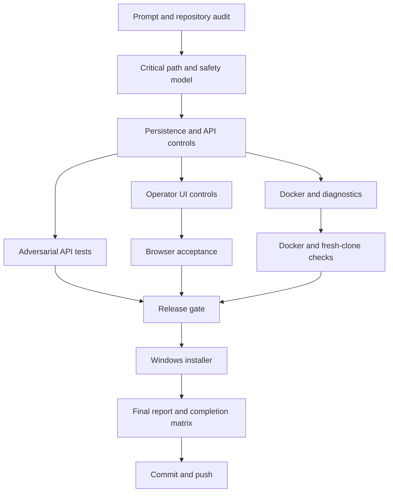

# Task Graph

External blocked work is not on the executable graph: MicroMentor API authorization, app-level team identity/RBAC, Authenticode signing, and a managed update channel require systems or credentials outside this repository.
